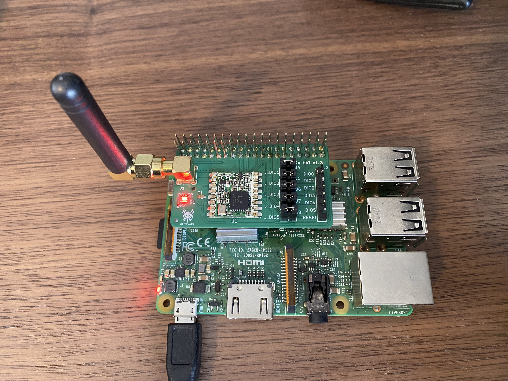

# 👽 XenoLabs LoRa Raspberry Pi HAT

A compact, high-performance LoRa HAT for Raspberry Pi — designed for long-range wireless communication, custom mesh protocols, and rapid prototyping.



## 🔧 Features

- Semtech SX1276/78 LoRa radio (RFM95W)
- Frequency: 915 MHz (AU/NZ/US)
- Fully compatible with Raspberry Pi 3/4/5
- 3.3V logic-level safe
- Low power consumption
- SMA antenna connector
- DIO breakout pins
- Jumpers to toggle direct connection to Pi GPIOs
- Designed by [XenoLabs](https://xeno-labs.io)

## 📦 Repository Contents
```
lora-pi-hat/
├── firmware/ # Example Python code
├── images/ # Photos and diagrams
└── README.md
```
## 🚀 Getting Started

### 🧰 Requirements

- Raspberry Pi 3, 4, or 5
- Python 3.7+
- LoRa HAT attached to GPIO header

### 📥 Install Dependencies

Install the Python dependencies
```bash
pip install adafruit-circuitpython-rfm9x
```
Enable SPI on Raspberry Pi
```bash
sudo raspi-config

-> 5 Interfacing Options -> P4 SPI -> <Yes>

sudo reboot
```

You can now run the demo (in the Firmware directory of this repo)!

For Transmitter:
```bash
python3 lora-tx.py
```

For Receiver:
```bash
python3 lora-rx.py
```


### 🛠️ Troubleshoot

If you get the error `lgpio.error: 'GPIO busy'` and `/dev/spidev0.1` is present when listing '/dev'

```bash
ls /dev/spidev*
/dev/spidev0.0  /dev/spidev0.1
```

SPI driver will not allow the code to use CS1.

Add the following line to `/boot/firmware/config.txt` and reboot.

```bash
dtoverlay=spi0-0cs
```

Ensure the output of `ls /dev/spidev*` does not contain `/dev/spidev0.1`

```bash
ls /dev/spidev*
/dev/spidev0.0
```

## 📌 Pinout

| Function | Pi GPIO Pin | Physical Pin | Notes                                           |
|----------|-------------|--------------|-------------------------------------------------|
| DIO0     | GPIO25      | 22           |                                                 |
| DIO1     | GPIO17      | 11           |                                                 |
| DIO3     | GPIO27      | 13           |                                                 |
| DIO4     | GPIO22      | 15           |                                                 |
| DIO5     | GPIO23      | 16           |                                                 |
| DIO6     | GPIO24      | 18           |                                                 |
| MOSI     | GPIO10      | 19           | SPI MOSI                                        |
| MISO     | GPIO9       | 21           | SPI MISO                                        |
| SCK      | GPIO11      | 23           | SPI Clock                                       |
| NSS      | GPIO7       | 26           | SPI Chip Select (CE1 / can be reassigned)       |
| RESET    | GPIO5       | 29           | LoRa reset pin                                  |

> **Note**: DIO pins can be disconnected from the Pi by removing the respective jumpers on the HAT.