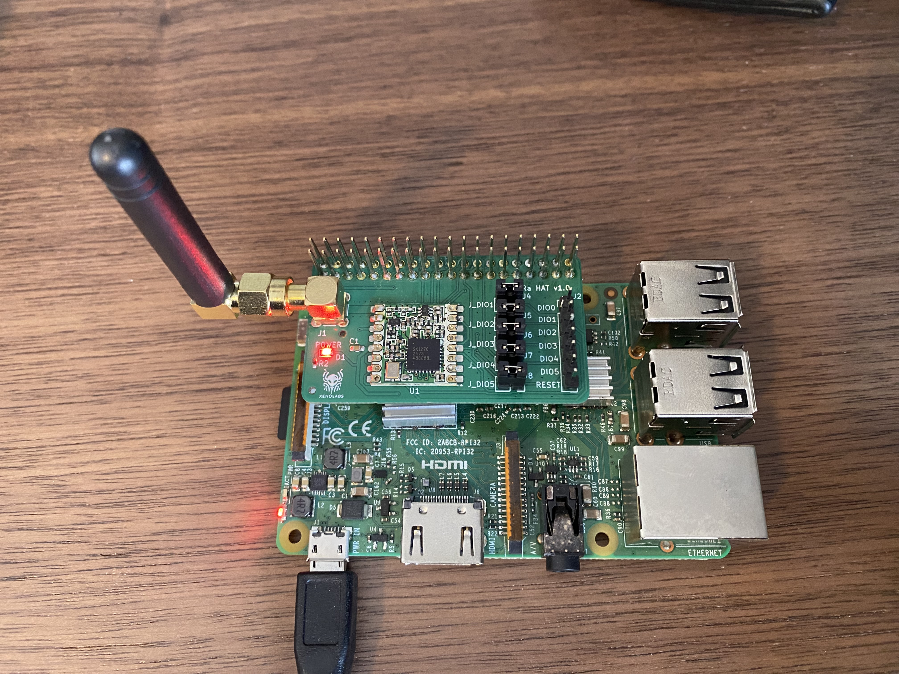
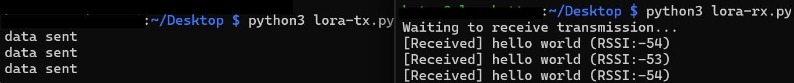

# 📩 Contact me
Contact me on Discord - kyteg

# XenoLabs LoRa Raspberry Pi HAT

A compact, high-performance LoRa HAT for Raspberry Pi designed for long-range wireless communication, custom mesh protocols, and rapid prototyping.



## Features

- RFM95W LoRa radio
- Frequency: 915 MHz (AU/NZ/US)
- Compatible with Raspberry Pi 3/4/5
- Compatible with Meshtastic (meshtasticd)

## Getting Started

### Meshtastic

To get started with Meshtastic, you can run `setup-meshtastic.sh` on your raspberry pi: 

```
wget https://raw.githubusercontent.com/kyteg/LoRa-Hat/refs/heads/main/setup-meshtastic.sh
chmod +x setup-meshtastic.sh
sudo ./setup-meshtastic.sh
```

Once set up, you can access the Web UI:

Navigate to `https://[IP of your Raspberry Pi]` (you may need to get past browser warnings).

Select "New Connection" and "connect" (Your Pi's IP address should be prefilled in the HTTP section)


Alternatively, you can set up Meshtasticd manually:

#### Install Meshtastic Daemon
```bash
sudo apt update
sudo apt install meshtasticd
```

#### Enable SPI
Ensure SPI is enabled:

```bash
sudo raspi-config
# Interface Options -> SPI -> Enable
sudo reboot
```

#### Check we're using CE0

Add the following line to `/boot/firmware/config.txt` and reboot.

```bash
dtoverlay=spi0-0cs
```

Ensure the output of `ls /dev/spidev*` does not contain `/dev/spidev0.1`

```bash
ls /dev/spidev*
/dev/spidev0.0
```

#### Configure Meshtastic

Edit the configuration file:

```bash
sudo nano /etc/meshtasticd/config.yaml
```

Use the following configuration:

```bash
Lora:
  Module: RF95
  CS: 7
  IRQ: 25
  Reset: 5

SPI:
  Device: /dev/spidev0.0
  Speed: 125000
  GpioChip: /dev/gpiochip0

Webserver:
  Port: 443 # Port for Webserver & Webservices
  RootPath: /usr/share/meshtasticd/web # Root Dir of WebServer
```

#### Start the Service
```bash
sudo systemctl enable meshtasticd
sudo systemctl start meshtasticd
```

Check logs:
```bash
journalctl -u meshtasticd -f
```

You should see the radio initialise successfully.

If not, make changes to the configuration and restart the meshtasticd service with: 
```bash
sudo systemctl daemon-reload
sudo systemctl restart meshtasticd
```

#### Install Meshtastic CLI
```bash
pip3 install meshtastic
```

### Lora Radio

If you would like to experiment with LoRa without Meshtastic, please see the following:

Prerequisite - Python3 should be installed on your Pi.

#### Install dependencies

Install the Python dependencies
```bash
pip install adafruit-circuitpython-rfm9x
```
Enable SPI on Raspberry Pi
```bash
sudo raspi-config

-> 5 Interfacing Options -> P4 SPI -> <Yes>

sudo reboot
```

#### Ensure use of CE0

Add the following line to `/boot/firmware/config.txt` and reboot.

```bash
dtoverlay=spi0-0cs
```

Ensure the output of `ls /dev/spidev*` does not contain `/dev/spidev0.1`

```bash
ls /dev/spidev*
/dev/spidev0.0
```

#### Run the demo

You can now run the demo (in the Firmware directory of this repo)!

For Transmitter:
```bash
python3 lora-tx.py
```

For Receiver:
```bash
python3 lora-rx.py
```



## Pinout

| Function | Pi GPIO Pin | Physical Pin | Notes                                           |
|----------|-------------|--------------|-------------------------------------------------|
| DIO0     | GPIO25      | 22           |                                                 |
| DIO1     | GPIO17      | 11           |                                                 |
| DIO3     | GPIO27      | 13           |                                                 |
| DIO4     | GPIO22      | 15           |                                                 |
| DIO5     | GPIO23      | 16           |                                                 |
| DIO6     | GPIO24      | 18           |                                                 |
| MOSI     | GPIO10      | 19           | SPI MOSI                                        |
| MISO     | GPIO9       | 21           | SPI MISO                                        |
| SCK      | GPIO11      | 23           | SPI Clock                                       |
| NSS      | GPIO7       | 26           | SPI Chip Select (CE1 / can be reassigned)       |
| RESET    | GPIO5       | 29           | LoRa reset pin                                  |

> **Note**: DIO pins can be disconnected from the Pi by removing the respective jumpers on the HAT.

## Referenfes

- RFM95W datasheet: https://cdn.sparkfun.com/assets/a/9/6/1/0/RFM95W-V2.0.pdf
- adafruit-circuitpython-rfm9x docs https://docs.circuitpython.org/projects/rfm9x/en/latest/api.html
- adafruit-circuitpython-rfm9x GitHub page https://github.com/adafruit/Adafruit_CircuitPython_RFM
